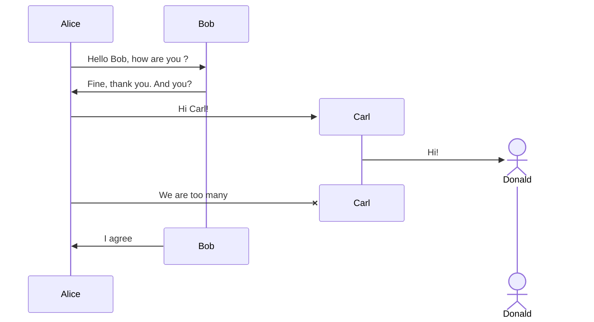
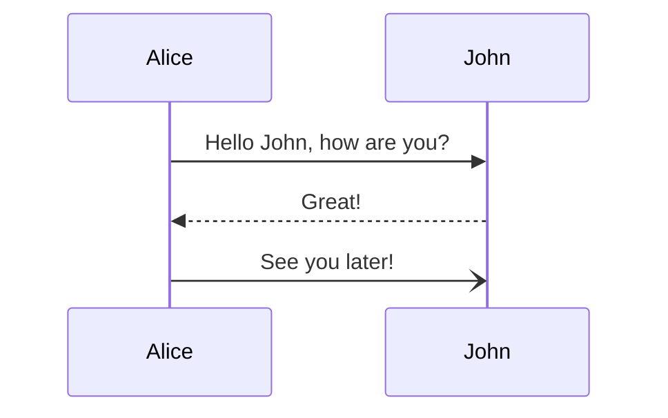
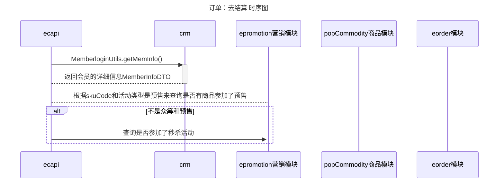

## 今天的灵感或闪念

  
return 如果有商品参加了预售，则抛出错误结束

ecapi --> popCommodity商品模块 ++:根据List<skuCode>到商品模块查询商品详细信息  
return 返回商品详细信息

ecapi -> ecapi: 组装下架商品，组装商品详细信息，每件相同商品一条记录

ecapi --> crm ++: 根据addressId和会员id查询  
return 返回地址详细信息

ecapi --> ecapi: 根据商品的售卖地区，判断是否可售，不可售则加入不可售商品

ecapi --> ecapi: 根据skuCode计算每个的购买数量到skuCodeCountMap

return 该商品参加了秒杀活动，是则判断是否在秒杀时间内  
ecapi --> eorder模块 ++: 根据活动类型和skuCode查询商品库存  
return 验证库存是否足够，并且校验限购  
end

ecapi --> eorder模块 ++: 众筹算价或者其他算价  
return 返回算价结构

alt 赠品处理逻辑  
ecapi --> ecapi:是否命中赠品规则  
end
