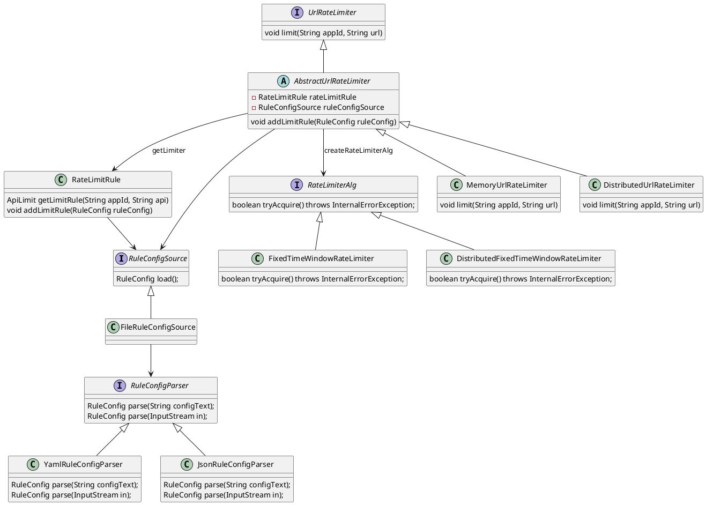

## 理论，参考 [[限流算法]]

## 资料

[Site Unreachable](https://book.clickear.top/98-%E8%AE%BE%E8%AE%A1%E6%A8%A1%E5%BC%8F%E4%B9%8B%E7%BE%8E/11%E4%B8%A8%E5%BC%80%E6%BA%90%E4%B8%8E%E9%A1%B9%E7%9B%AE%E5%AE%9E%E6%88%98%EF%BC%9A%E9%A1%B9%E7%9B%AE%E5%AE%9E%E6%88%98%20(9%E8%AE%B2)/92%E4%B8%A8%E9%A1%B9%E7%9B%AE%E5%AE%9E%E6%88%98%E4%B8%80%EF%BC%9A%E8%AE%BE%E8%AE%A1%E5%AE%9E%E7%8E%B0%E4%B8%80%E4%B8%AA%E6%94%AF%E6%8C%81%E5%90%84%E7%A7%8D%E7%AE%97%E6%B3%95%E7%9A%84%E9%99%90%E6%B5%81%E6%A1%86%E6%9E%B6%EF%BC%88%E5%AE%9E%E7%8E%B0%EF%BC%89.html)
