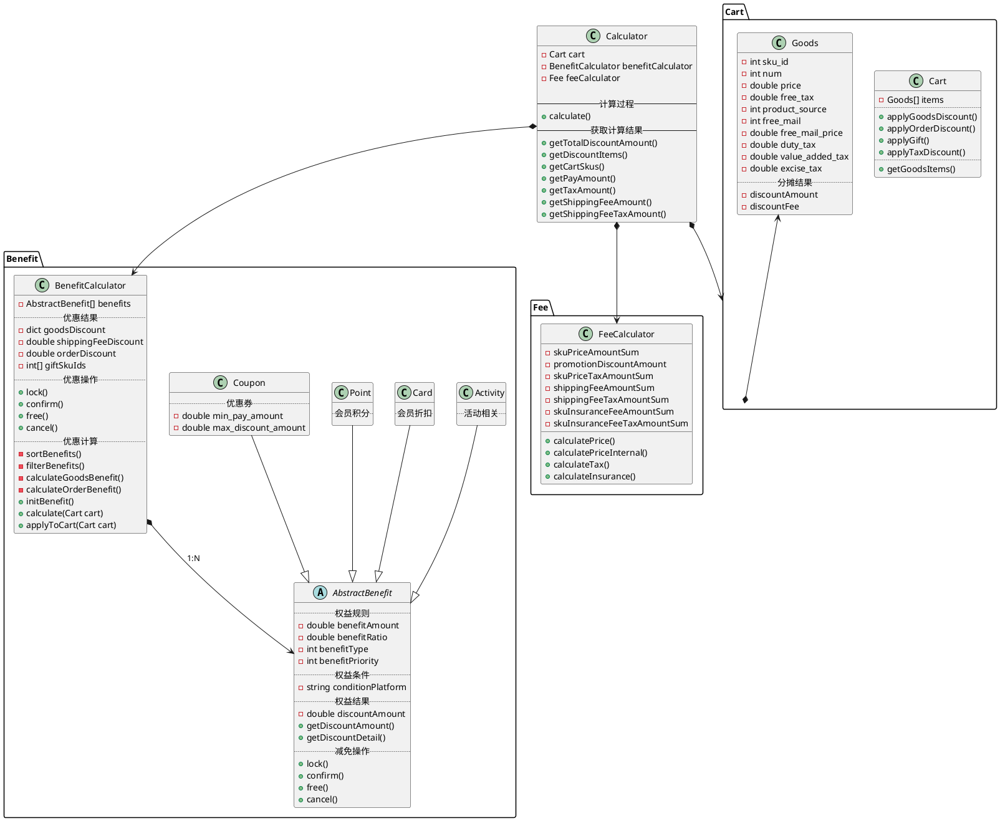

## 一、掌握需求

接到一个业务需求之后，先别急着下手，开工之前把业务梳理清楚，先吾日「三省」吾身：

1. 「昨天」之前业务逻辑是怎样的
2. 「今天」当前需求修改的背景是什么，目的是什么，带来的收益是什么
3. 「明天」需求修改后对当前系统业务扩展性和维护成本有哪些影响

## 二、需求等级划分

【作为参考】我们将需求按照「影响范围&开发成本」为三个等级：L（Light-load）级别、M（Medium-load）级别、H（Heavy-load）级别，判定规则如下：  

## 三、技术评审包含内容

其中，M和H级别需求必须要进行技术评审，M级别可以相关内容维护人员一起参加，H级别建议各个模块都知会到。

### 一 前期准备:

1.数据库ER图

2.uml类图

3.业务流程图

4.系统时序图

5.系统个业务边界

6.待讨论问题汇总

### 二 技术评审中:

1.根据需求串联各个业务流程<系统时序图>(外部沟通)

2.确定业务边界<重要>(外部沟通)

确定原则:

1)边界问题

职责问题 业务部门边界

领域问题 该领域需要在哪个系统下更合理

  

3.提出设计方案(内部设计)

1).数据库设计  
2).代码设计模式<通过类图展现>  
3).技术策略<MQ, 异步, 重试>  
4.待讨论解决  
        1).给出待解决问题的解决方案,沉淀到需求wiki 上

5.提出问题  
         给出线上需求确认的问题,并会后进行跟进

### 三 技术评审后:

        1.跟进会上需要确认的问题
        2.确认开发排期
        3.给出开发文档

其中，M和H级别需求必须要进行技术评审，**M级别**可以相关内容**维护人员**一起参加，**H级别**建议各个模块都知会到。

注：虽然L级别不做强制要求，但是为了能更好的完成需求理解需求，建议自己过一下完整技术评审流程，养成好的职业习惯。

## 内容沉淀：

将技术评审内容沉淀维护在仓储： [https://git.qufenqi.com/qpark/architecture/plantuml/](https://git.qufenqi.com/qpark/architecture/plantuml/-/tree/f_education_xufeng/c4/component/education/requirements/template)

注：按照需求维度在c4/component/education/requirements目录下以需求名称创建文件夹，然后以wiki形式产出技术评审内容，且设计图片来源gitlab，用以保证图片更新后也能同步wiki，参考 「[模板](http://wiki.qudian.com/pages/viewpage.action?pageId=54699737)」作为技术评审时主讲内容。

以下内容为建议，可根据实际情况进行：

### 1.ER图

举个栗子：  

### 2.uml类图

举个栗子（排课设计）：  

### 3.业务流程图

举个栗子（排课流程图）：  

### 4.时序图

举个栗子（约课时序图）：  

### 5.用例图

举个栗子（约课用例图）：  

## 四、功能拆分&排期梳理

其中M和H级别需求，项目负责人一定要将功能拆分到每一项具体任务并给出单项排期，且单项具体任务排期应小于等于8h（大多数任务最小粒度不会大于8h，如果大于，也可以继续拆分）

## 五、设计工具

官网学习：[https://plantuml.com/zh/](https://plantuml.com/zh/)

真实项目演示：

Jetbrains 系列 IDE插件：[https://plugins.jetbrains.com/plugin/7017-plantuml-integration](https://plugins.jetbrains.com/plugin/7017-plantuml-integration)

